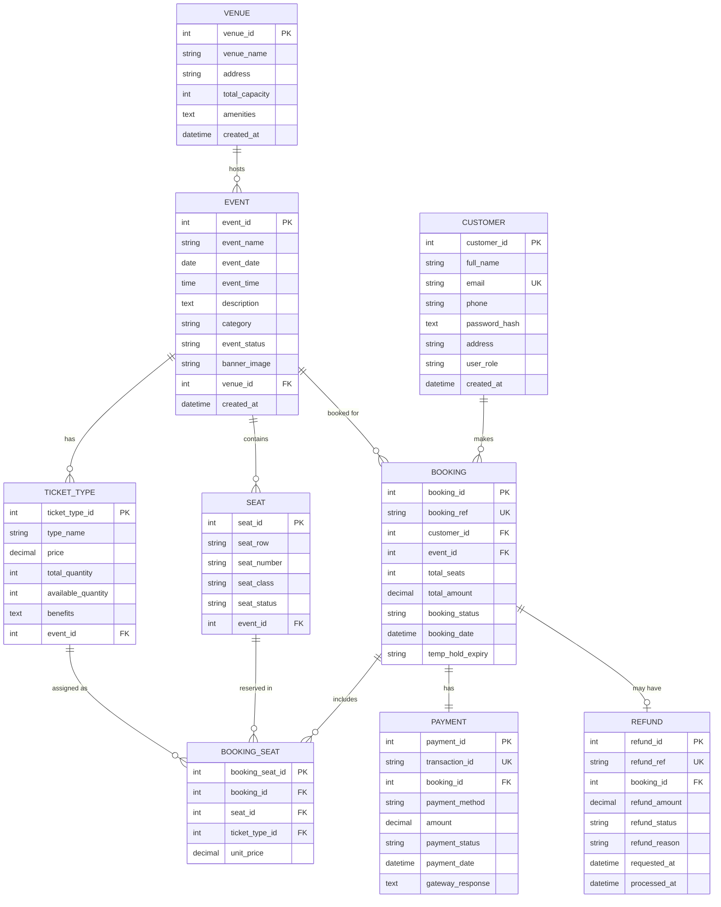

# UML DIAGRAMS - Online Event Ticket Booking System

---

## 7. USE CASE DIAGRAM

### Actor Definitions
| Actor | Description |
|-------|-------------|
| **Customer** | Unregistered/Registered user who browses events and books tickets |
| **Admin** | Event organizer with full management privileges |
| **Payment Gateway** | External system for processing payments (external actor) |
| **Email Service** | External system for sending notifications (external actor) |

```mermaid
useCaseDiagram
    title Online Event Ticket Booking System - Use Case Diagram

    actor Customer as C
    actor Admin as A
    actor "Payment Gateway" as PG
    actor "Email Service" as ES

    package "Customer & Ticket Management" {
        usecase "Register Account" as UC1
        usecase "Login / Logout" as UC2
        usecase "Manage Profile" as UC3
        usecase "View Booking History" as UC4
        usecase "Download E-Ticket" as UC5
    }

    package "Event & Venue Management" {
        usecase "Browse Events" as UC6
        usecase "Search / Filter Events" as UC7
        usecase "View Event Details" as UC8
        usecase "Manage Events (CRUD)" as UC9
        usecase "Manage Venues (CRUD)" as UC10
        usecase "Define Ticket Types" as UC11
    }

    package "Seat & Booking Management" {
        usecase "Select Seats" as UC12
        usecase "Temporarily Hold Seats" as UC13
        usecase "Create Booking" as UC14
        usecase "Modify Booking" as UC15
        usecase "View Seat Map" as UC16
    }

    package "Payment, Cancellation & Refund" {
        usecase "Process Payment" as UC17
        usecase "Cancel Booking" as UC18
        usecase "Request Refund" as UC19
        usecase "Track Refund Status" as UC20
        usecase "View Payment Receipt" as UC21
    }

    package "Admin Dashboard" {
        usecase "View Sales Reports" as UC22
        usecase "Manage All Bookings" as UC23
        usecase "Override Refunds" as UC24
    }

    %% Customer Use Cases
    C --> UC1
    C --> UC2
    C --> UC3
    C --> UC4
    C --> UC5
    C --> UC6
    C --> UC7
    C --> UC8
    C --> UC12
    C --> UC14
    C --> UC15
    C --> UC16
    C --> UC17
    C --> UC18
    C --> UC19
    C --> UC20
    C --> UC21

    %% Admin Use Cases
    A --> UC2
    A --> UC9
    A --> UC10
    A --> UC11
    A --> UC22
    A --> UC23
    A --> UC24

    %% External System Associations
    UC17 --> PG : <<includes>>
    UC1 --> ES : <<includes>>
    UC14 --> ES : <<includes>>
    UC18 --> ES : <<includes>>
    UC19 --> ES : <<includes>>

    %% Include Relationships
    UC14 ..> UC13 : <<include>>
    UC18 ..> UC19 : <<include>>
    UC17 ..> UC13 : <<extend>> : payment success releases hold
```

---

### Use Case Descriptions (Detailed)

#### UC1: Register Account
- **Actor:** Customer
- **Pre-condition:** Customer is not logged in
- **Main Flow:** Customer enters name, email, phone, password → System validates → Creates account → Sends welcome email
- **Alternate Flow:** Email already exists → Error message
- **Post-condition:** Customer account created and logged in

#### UC6: Browse Events
- **Actor:** Customer
- **Pre-condition:** System has published events
- **Main Flow:** Customer visits homepage → Displays featured/upcoming events → Filter by category/date → Select event
- **Post-condition:** Customer views event details page

#### UC12 + UC14: Select Seats & Create Booking
- **Actor:** Customer
- **Pre-condition:** Event has available seats, Customer is logged in
- **Main Flow:** Customer opens seat map → Selects seats → System holds seats (10 min) → Redirect to checkout → Review order → Proceed to payment
- **Alternate Flow:** Seats already booked → Error, select different seats; Timeout → Seats released
- **Post-condition:** Booking created (pending payment)

#### UC17: Process Payment
- **Actor:** Customer, Payment Gateway
- **Pre-condition:** Booking is in PENDING state, seats are held
- **Main Flow:** Customer selects payment method → Enters payment details → Gateway validates → Payment successful → Booking confirmed → E-ticket generated → Notification sent
- **Alternate Flow:** Payment fails → Retry option / Seats released after timeout
- **Post-condition:** Booking status = CONFIRMED, tickets generated

#### UC18 + UC19: Cancel Booking & Refund
- **Actor:** Customer, Email Service
- **Pre-condition:** Booking is CONFIRMED, event date > 24 hours away
- **Main Flow:** Customer selects booking → Cancel option → System shows refund estimate → Confirm cancel → Refund calculated → Status updated → Seats released → Notification sent
- **Post-condition:** Booking = CANCELLED, Refund = INITIATED, seats back to inventory

#### UC9: Manage Events (CRUD)
- **Actor:** Admin
- **Pre-condition:** Admin is authenticated
- **Main Flow:** Admin creates event (name, date, time, description, category, venue) → Assigns ticket types with prices → Publishes event
- **Alternate Flow:** Edit / Delete event (delete only if no bookings)

---

## 8. ENTITY RELATIONSHIP (ER) DIAGRAM



---

### ER Diagram Explanation

#### Entities & Attributes Summary

| Entity | Primary Key | Key Attributes |
|--------|-------------|----------------|
| **VENUE** | venue_id | venue_name, address, total_capacity, amenities |
| **EVENT** | event_id | event_name, event_date, event_time, category, event_status, venue_id (FK) |
| **TICKET_TYPE** | ticket_type_id | type_name, price, total_quantity, event_id (FK) |
| **SEAT** | seat_id | seat_row, seat_number, seat_class, seat_status, event_id (FK) |
| **CUSTOMER** | customer_id | full_name, email (unique), phone, password_hash, user_role |
| **BOOKING** | booking_id | booking_ref (unique), customer_id (FK), event_id (FK), total_seats, total_amount, booking_status |
| **BOOKING_SEAT** | booking_seat_id | booking_id (FK), seat_id (FK), ticket_type_id (FK), unit_price |
| **PAYMENT** | payment_id | transaction_id (unique), booking_id (FK), payment_method, amount, payment_status |
| **REFUND** | refund_id | refund_ref (unique), booking_id (FK), refund_amount, refund_status |

#### Relationship Cardinality
1. **VENUE → EVENT (1:N)** : One venue can host multiple events; each event belongs to exactly one venue
2. **EVENT → TICKET_TYPE (1:N)** : One event can have multiple ticket types (VIP, Standard, etc.)
3. **EVENT → SEAT (1:N)** : One event has multiple seats (generated based on venue capacity)
4. **CUSTOMER → BOOKING (1:N)** : One customer can make multiple bookings
5. **EVENT → BOOKING (1:N)** : One event can have multiple bookings
6. **BOOKING → BOOKING_SEAT (1:N)** : One booking includes multiple seats; link table resolves M:N
7. **SEAT → BOOKING_SEAT (1:N)** : A seat can appear in many booking records over time (cancelled/rebooked)
8. **TICKET_TYPE → BOOKING_SEAT (1:N)** : Ticket type assigned per seat in a booking
9. **BOOKING → PAYMENT (1:1)** : Each booking has exactly one payment record
10. **BOOKING → REFUND (1:0..1)** : A booking may have zero or one refund (partial not shown here for simplicity)

---

*Document Version: 1.0 | Diagrams use Mermaid syntax (render on GitHub, Mermaid Live Editor)*
